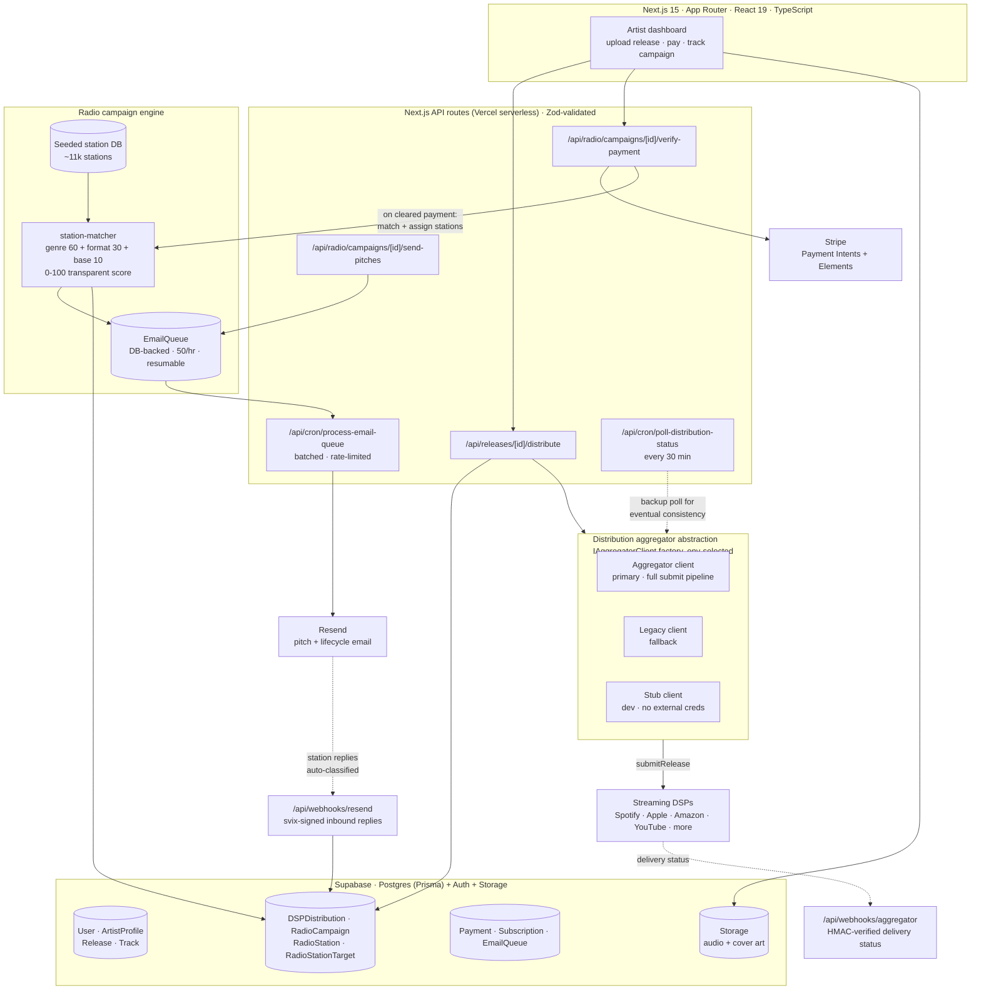

# SoundLaunch

A self-serve platform for independent musicians that combines **music distribution** and **radio promotion** in one flow. An artist uploads a release, pays for a plan, and the platform distributes it to streaming services and runs a throttled, reply-tracked radio-pitch campaign against a seeded database of roughly eleven thousand stations.

Built solo under NerdJoy LLC. This is an architecture overview; the source is private.

## What it is

Most indie artists juggle two separate vendors: one to get a release onto Spotify and Apple Music, another to pitch it to radio. SoundLaunch does both from a single upload. An artist uploads tracks, cover art, and metadata; the app hands the release to a distribution aggregator for delivery to the DSPs, and in parallel it auto-matches the release to genre-appropriate radio stations and sends personalized pitch emails at a controlled rate, then tracks replies and reports which stations are interested or playing.

End to end: **upload, distribute to streaming, seed-matched radio campaign, throttled outreach, reply tracking and analytics.**

## Architecture

## Key flows

**1. Release, then distribute.** An artist creates a release and uploads audio and art to Supabase Storage; cover art is auto-resized per-DSP spec. `POST /api/releases/[id]/distribute` validates the requested platforms, writes `DSPDistribution` rows as `PENDING` inside a Prisma transaction, hands the release to the aggregator, and moves the release to `PROCESSING`. Delivery status arrives asynchronously via an HMAC-verified aggregator webhook, with a cron poller as a backstop so status still reconciles if a webhook is missed.

**2. Radio campaign matching.** When a campaign payment clears, `verify-payment` activates the campaign and (inline, not fire-and-forget) runs the station matcher: a transparent 0 to 100 score built from genre match, format match, and a base weight, over a seeded database of roughly eleven thousand stations. The top matches become `RadioStationTarget` rows for the campaign.

**3. Throttled outreach and reply tracking.** `send-pitches` enqueues `EmailQueue` rows spaced for fifty sends per hour. A cron job drains the queue in small batches through Resend, with retries and lifecycle emails. Each pitch carries a structured reply-to address that encodes the campaign and station; inbound replies hit a svix-signed Resend webhook that parses that address, marks that station as responded, and classifies the response (interested, playing, not a fit).

## Design decisions worth calling out

- **Pluggable distribution behind one interface.** Distribution is aggregator-mediated, not direct DSP APIs, and every aggregator sits behind a single `IAggregatorClient` interface chosen by environment variable: a primary client, a legacy fallback, and a stub that lets the whole app run in development with no external credentials. Swapping distribution backends is a config change, not a rewrite.
- **Serverless-correct async.** Station matching is awaited inline so it completes before the Vercel function tears down, while slow outbound email is deliberately decoupled into a DB-backed queue drained by cron. A background poller backstops webhook delivery so the system converges even when an event is dropped.
- **Throttled, resumable email pipeline.** Outreach lives in a `EmailQueue` table with rate limiting (fifty per hour), batching, and retries. Because state is in the database rather than in memory, a redeploy or a crash mid-campaign resumes exactly where it left off instead of double-sending or stalling.
- **Two-way email as data.** The reply-to address encodes campaign and station IDs, so an inbound reply is parsed straight into a classified campaign event. Webhooks in both directions (aggregator and email) are signature-verified, with an explicit test-mode bypass for local runs.
- **Deterministic, explainable matching.** Station matching is a transparent additive score, not a black box, so a campaign's targeting is inspectable and tunable.
- **Idempotent, transactional writes.** `PENDING` distribution rows are created in a transaction before the external call, then reconciled by webhook and poller, so retries never corrupt state.
- **Tiered productization.** Campaign tiers gate station volume and distribution entitlements, mapping cleanly onto the payment and subscription models.
- **Offline data engineering, cleanly separated.** The station database was built by an offline ETL and enrichment pipeline (public FCC data plus AI enrichment). Those scripts are a build-time concern and are kept entirely out of the request/response runtime.

## Stack

Next.js 15 (App Router) · React 19 · TypeScript · Tailwind CSS. Supabase (Postgres, Auth, Storage) with Prisma as the ORM. Stripe (Payment Intents + Elements) for payments. Resend for transactional and pitch email, plus a signed inbound-reply webhook. `sharp` for per-platform cover-art resizing, `music-metadata` for audio parsing. Sentry and PostHog for observability and flags. Playwright for end-to-end and API tests. Deployed on Vercel with Vercel Cron.

## Status

Built and operated solo under NerdJoy LLC. Architecture overview only; the full source lives in a private repository. Happy to walk through the aggregator abstraction, the resumable email pipeline, or the two-way webhook design in detail.
